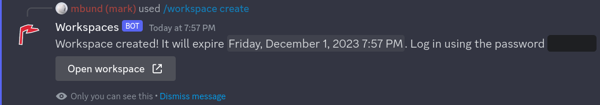
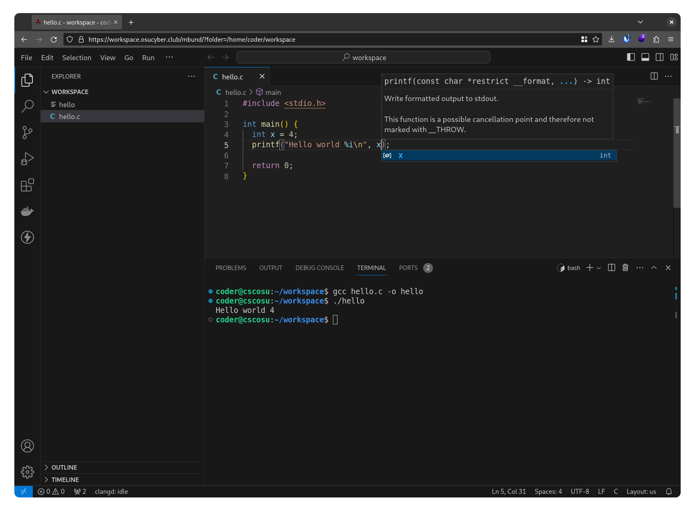

## About

Provision VS Code server workspaces as Kubernetes resources from a Discord bot.





## Usage

Apply the manifests to deploy the bot with proper permissions into its own namespace. Note that this bot is only designed to work with the Cyber Security Club's Kubernetes cluster. It has a few hardcoded role id's and requires the [sysbox](https://github.com/nestybox/sysbox) runtime to be installed on the cluster.

```
kubectl apply -f manifests.yaml
```
